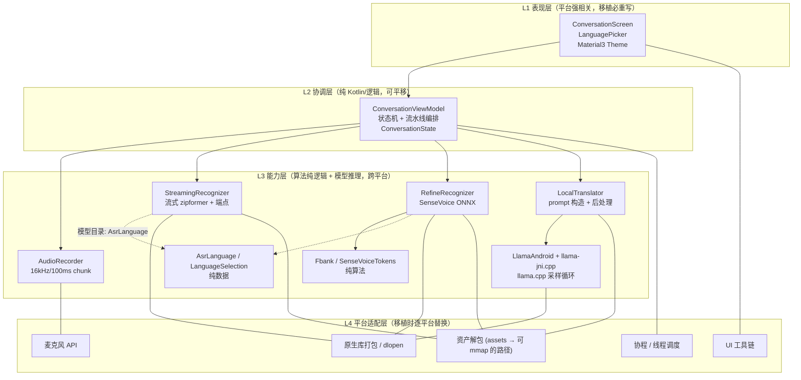
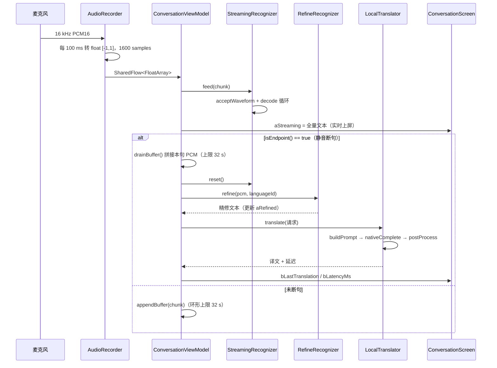
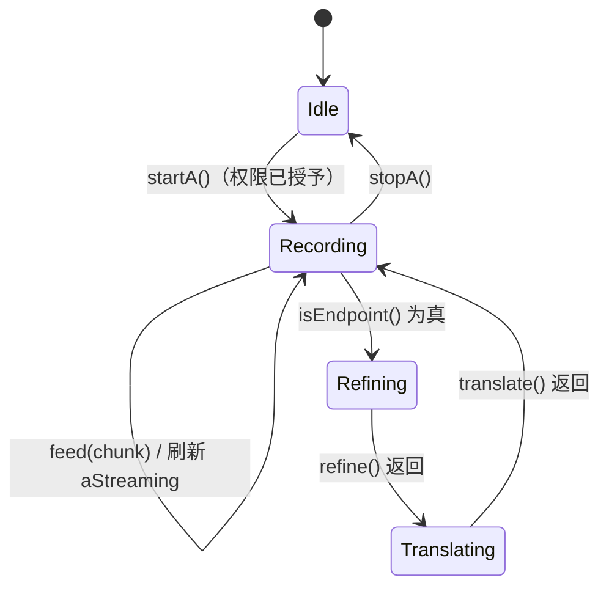

# VoiceTranslator 概要设计书

| 项 | 内容 |
|---|---|
| 文档版本 | v1.0 |
| 编制日期 | 2026-09-11 |
| 对应软件版本 | 0.1.0（versionCode 1） |
| 基线代码 | Android 工程 `VoiceTranslator/`（AGP 8.7.3 / Kotlin 2.0.21） |
| 文档性质 | 概要设计（High-Level Design）。**核心用途：作为后续移植到 iOS / 桌面 / Web / 服务端的唯一设计依据** |
| 读者 | 负责移植的工程师、后续维护者、架构评审 |

---

## 0. 文档说明

### 0.1 目的

本文档描述 VoiceTranslator 的**分层架构、模块职责、接口契约、数据规格、关键算法与构建约束**，并在此基础上给出**可移植性分层模型与逐平台移植映射表**。

与既有文档的分工：

| 文档 | 定位 | 是否面向移植 |
|---|---|---|
| `README.md` | 快速上手 / 一键搭建 | 否 |
| `NEXT_STEPS.md` | 单次会话的推进清单（历史快照） | 否 |
| `app/src/main/jniLibs/README.md` | 原生库来源与版本约束备忘 | 部分 |
| **本文档** | **架构基线 + 移植依据** | **是** |

> 注意：`README.md` 与 `NEXT_STEPS.md` 中部分数据已滞后于代码（见 §10.3），**以本文档与源码为准**。

### 0.2 术语表

| 术语 | 含义 |
|---|---|
| ASR | Automatic Speech Recognition，语音识别 |
| 流式 ASR | 边说边出字的增量识别（本工程用 sherpa-onnx Zipformer） |
| 精修 ASR | 一句说完后对整段音频重识别，字错率显著更低（本工程用 SenseVoiceSmall） |
| 端点 / Endpoint | 一句话结束的判定点（静音触发），是"上屏 → 精修 → 翻译"的流水线切换信号 |
| LFR | Low Frame Rate 堆叠：把 7 帧 80 维 fbank 拼成 560 维，降低帧率 |
| CMVN | 倒谱均值方差归一化 |
| CTC | Connectionist Temporal Classification，SenseVoice 的输出解码方式 |
| SPI | Service Provider Interface，本文指为跨平台抽取的模块接口 |
| 16 KB page size | Android 15+ 对 `.so` LOAD 段对齐的要求（Google Play 2025-11-01 强制） |

---

## 1. 项目概述

### 1.1 产品定位

**完全离线、中/英/日/韩四语种、双向对话式语音翻译 App**。零网络依赖，语音数据不出设备。

一句话描述：*A 说中文、B 说外文，双方各自看到自己语言的文字译文；A→B 与 B→A 两条流可并行。*

### 1.2 设计目标与非目标

| 类别 | 内容 |
|---|---|
| 目标 G1 | 端侧纯离线，无任何网络权限依赖（`INTERNET` 仅声明未使用） |
| 目标 G2 | 低延迟：说话过程中实时上屏；一句话结束到译文出现控制在秒级 |
| 目标 G3 | 精度优先的分层策略：流式上屏（快、糙）+ SenseVoice 精修（慢 70ms、准）+ LLM 翻译（含 ASR 纠错） |
| 目标 G4 | **架构可移植**：算法与模型资产跨平台复用，平台相关部分收敛在明确的适配层内 |
| 目标 G5 | 合规：全部模型许可允许商用（Apache 2.0 / FunASR 开源许可） |
| 非目标 N1 | 不做流式同声传译（逐词翻译），只做"句级"翻译 |
| 非目标 N2 | 不做云端兜底/账号体系 |
| 非目标 N3 | v0.1 不做 TTS 语音合成播报 |
| 非目标 N4 | 不做 32 位 ABI（arm64-v8a 单 ABI） |

### 1.3 功能清单与实现状态

| 编号 | 功能 | 模块 | 状态 |
|---|---|---|---|
| F1 | 16 kHz 单声道 PCM 采集，100 ms 分块推送 | `AudioRecorder` | 已实现 |
| F2 | 流式 ASR 实时上屏 | `StreamingRecognizer` | 已实现 |
| F3 | 静音端点检测（自动断句） | `StreamingRecognizer` | 已实现 |
| F4 | 整句音频缓冲与拼接 | `ConversationViewModel` | 已实现 |
| F5 | 精修 ASR（SenseVoice + fbank + CMVN + CTC 解码） | `RefineRecognizer` / `Fbank` / `SenseVoiceTokens` | 已实现 |
| F6 | 本地 LLM 翻译（含 ASR 纠错提示词） | `LocalTranslator` / `LlamaAndroid` / `llama-jni.cpp` | 已实现 |
| F7 | 四语种枚举与语种 ID 映射 | `AsrLanguage` | 已实现 |
| F8 | A/B 语种选择 UI（下拉） | `LanguagePicker` | 已实现（回调为空，**不可改**，见 §10.2-I1） |
| F9 | A/B 语种一键互换 | `ConversationViewModel.switchLanguages` | 逻辑已实现，**UI 未接线**（图标无点击） |
| F10 | B→A 反向流（双人同时说话） | — | **未实现**（v0.2） |
| F11 | 对话历史气泡 / 持久化 | — | 未实现 |
| F12 | 热词偏置（`assets/tokens/hotwords.txt`） | — | 资产已备，未接线（v0.4） |
| F13 | 多语种 ASR 模型切换（英/韩/日） | `assets/models/` | 模型已就位，**运行时仅加载中英双语模型**（见 §10.2-I2） |

### 1.4 关键设计决策（ADR 摘要）

| 编号 | 决策 | 理由 | 放弃的方案 |
|---|---|---|---|
| D1 | 翻译模型用 **Qwen2.5-1.5B-Instruct Q4_K_M (GGUF)** | Apache 2.0 可商用；1 GB 体积；一个模型覆盖四语种；还能顺带纠正 ASR 同音字错 | NLLB-200（CC-BY-NC 禁商用）；专用小翻译模型（语向受限、无纠错能力） |
| D2 | ASR 走 **sherpa-onnx**，不自己接 ONNX Runtime 跑 Zipformer | 流式/端点检测/特征前端全是现成 C++ 实现，跨平台都有官方产物 | 自研 ONNX 流式管线（工作量大且需复刻 kaldi 前端） |
| D3 | 精修用 **SenseVoiceSmall**（第二个 ASR），而非提高流式模型精度 | 流式模型为了低延迟必须牺牲精度；两级结构让"快"和"准"解耦 | 只用一个模型（要么慢要么糙） |
| D4 | 特征前端 **Fbank 用 Kotlin 自实现**，不复用 sherpa 的 FeatureConfig | 避免多一个 native 依赖；特征规格固定，纯计算，**天然跨平台** | 调 sherpa 的 `acceptWaveform` 提特征（耦合、且拿不到 560 维 LFR 张量） |
| D5 | llama.cpp **源码静态链接**进 `libllama-translator.so` | 官方不发布 Android 版 `libllama.so`；外部预编译 `.so` 与 `llama.h` 易版本漂移 | jniLibs 放预编译 `libllama.so` |
| D6 | sherpa-onnx **手动集成**（`.so` + Kotlin 源码），不用 AAR | JitPack 构不出（仓库过大），官方也不发 AAR | `com.github.k2-fsa:sherpa-onnx-android` |
| D7 | 单 ABI `arm64-v8a` | llama.cpp 官方 Android 只支持 arm64；1B LLM 在 32 位机上不现实 | 多 ABI 打包 |
| D8 | 模型全部打进 APK assets | v0.1 求"装上就能跑"，无首启下载逻辑 | 首启下载 / Play Asset Delivery（见 §8.5 与 §10.2-I3） |

---

## 2. 总体架构设计

### 2.1 分层视图



**架构要点**

1. **单向数据流**：`ConversationState`（不可变 data class）经 `StateFlow` 下发，UI 只负责渲染与回调。移植时 UI 可整体替换，协调层不动。
2. **能力层不外泄平台概念**：除 `AudioRecorder` 与三个原生库绑定外，其余模块只依赖"float 数组进、字符串出"。
3. **两条 pass 解耦**：流式 pass 追求首字延迟（< 1 s），精修 pass 追求准确率（≈70 ms），翻译 pass 追求语义正确（1~3 s）。

### 2.2 运行时组件清单

| 组件 | 类型 | 进程内实例数 | 生命周期 |
|---|---|---|---|
| `AudioRecorder` | Kotlin class | 1 | ViewModel 持有，`onCleared()` 释放 |
| `StreamingRecognizer` | Kotlin class（含 sherpa `OnlineRecognizer` + `OnlineStream`） | 1 | 同上 |
| `RefineRecognizer` | Kotlin class（含 ORT `OrtSession`） | 1 | 同上，`close()` 关闭 session |
| `LocalTranslator` | Kotlin class（含 llama.cpp context） | 1 | 同上 |
| `ConversationViewModel` | AndroidViewModel | 1 | 随 Activity 存活 |
| `MainActivity` | ComponentActivity | 1 | — |
| `App` | Application | 1 | 进程级 |

### 2.3 端到端数据流（v0.1 实装路径）



### 2.4 线程与并发模型

| 执行体 | 所在线程 | 说明 |
|---|---|---|
| 音频读取循环 | 协程 `Dispatchers.IO`（`AudioRecorder` 内 `SupervisorJob` scope） | 阻塞式 `AudioRecord.read()` |
| 流水线收集 | `viewModelScope`（主线程） | `recorder.flow.collect{}` |
| 流式解码 `feed()` | **主线程**（在 collect 内同步执行） | 单块 100 ms 解码耗时远小于块长，未单独下发（**移植时的隐患，见 §9.8-R3**） |
| 精修推理 | `Dispatchers.Default` | `withContext` 包裹 |
| 翻译推理 | `Dispatchers.Default`（`LocalTranslator.translate` 内再次 `withContext`） | 嵌套 `withContext`，等效 Default |
| JNI 全部 `native*` | 调用线程 | C++ 侧 `g_mutex` 全局串行 |
| ORT session | 调用线程 | 未显式设 intra-op 之外的执行器；intra-op=2 |

> **关键约定**：llama.cpp 的 `nativeCreate/nativeComplete/nativeRelease` 在 C++ 侧由 `std::mutex g_mutex` 全局串行化，因此**任何平台移植都只需保证"同一 context 不并发调用"**，无需自己加锁。

### 2.5 状态模型

```kotlin
data class ConversationState(
    val lang: LanguageSelection = LanguageSelection(),  // A/B 语种
    val aRecording: Boolean = false,
    val aStreaming: String = "",       // 流式上屏（每块音频刷新）
    val aRefined: String = "",         // 精修结果（端点触发后）
    val bLastTranslation: String = "", // 译文
    val bLatencyMs: Long = 0,          // 翻译耗时
    val error: String? = null,         // 错误提示（当前仅权限/录音失败）
)
```

状态机（录音侧）：



---

## 3. 模块设计

模块总表（**平台耦合度**是移植工作量的直接指标）：

| 模块 | 文件 | 行数量级 | 平台耦合度 | 移植动作 |
|---|---|---|---|---|
| 音频采集 | `audio/AudioRecorder.kt` | 95 | **高**（AudioRecord） | 重写（换平台音频 API） |
| 流式识别 | `asr/StreamingRecognizer.kt` | 119 | 中（sherpa .so + assets 解包） | 换 sherpa 绑定 + 换资产加载 |
| 精修识别 | `asr/RefineRecognizer.kt` | 150 | 中（ORT + assets） | 换 ORT 绑定 + 资产加载 |
| 特征前端 | `asr/Fbank.kt` | 217 | **无** | 直接复用（算法平移） |
| 文本解码 | `asr/SenseVoiceTokens.kt` | 127 | 低（仅读 assets） | 换文件读取方式即可 |
| 翻译封装 | `translate/LocalTranslator.kt` | 99 | 低（assets 落盘） | 换模型路径提供者 |
| LLM 运行时 | `translate/LlamaAndroid.kt` + `cpp/llama-jni.cpp` | 49 + 279 | **高**（JNI） | 保留 C++ 逻辑，删掉 JNI 壳换成直接 C++ 调用 |
| 语种模型 | `asr/AsrLanguage.kt` + `lang/Language.kt` | 55 | **无** | 直接复用 |
| 协调层 | `viewmodel/ConversationViewModel.kt` | 157 | 低（仅 `AndroidViewModel`/协程） | 换 ViewModel 基类 |
| UI | `ui/*.kt` + `ui/theme/*` | 约 310 | **高**（Compose/Material3） | 重写 |
| 外壳 | `MainActivity.kt` + `App.kt` + `AndroidManifest.xml` | 79 + XML | **高** | 重写 |

### 3.1 音频采集模块 `AudioRecorder`

**职责**：把麦克风数据统一成"16 kHz / 单声道 / float32 / 100 ms 一块"的流。

**接口**

```kotlin
class AudioRecorder(
    sampleRate: Int = 16_000,
    channelConfig: Int = AudioFormat.CHANNEL_IN_MONO,
    audioFormat: Int = AudioFormat.ENCODING_PCM_16BIT,
    chunkMillis: Int = 100,
) {
    val flow: SharedFlow<FloatArray>                 // 每块 1600 samples
    fun hasPermission(ctx: Context): Boolean
    fun start(onError: (Throwable) -> Unit = {})
    fun stop()
    fun release()
}
```

**实现要点**

| 项 | 取值 | 说明 |
|---|---|---|
| 采集源 | `MediaRecorder.AudioSource.VOICE_RECOGNITION` | 系统侧会做部分降噪/AGC，利于 ASR |
| 缓冲 | `getMinBufferSize() * 4` | 留 4 倍余量防 underrun |
| 缓冲类型 | `ShortArray` → `FloatArray`（`/32768f`） | 归一化到 `[-1, 1]` |
| 背压 | `MutableSharedFlow(extraBufferCapacity = 64)` | 丢帧优先于阻塞采集线程 |
| 错误 | `ERROR_INVALID_OPERATION` / `ERROR_BAD_VALUE` 终止循环 | 其余 `n<=0` 跳过 |

**平台耦合点（移植替换清单）**

| 需要替换的东西 | iOS 等价 | 桌面等价 | Web 等价 |
|---|---|---|---|
| `AudioRecord` | `AVAudioEngine` + `AVAudioConverter` | WASAPI(Windows) / CoreAudio(macOS) / ALSA-PulseAudio(Linux)，或 `miniaudio` / `RtAudio` | `getUserMedia` + `AudioWorklet` |
| `RECORD_AUDIO` 权限 | `AVAudioSession.requestRecordPermission` | 各系统隐私授权 | 浏览器权限提示 |
| `Short→Float` 归一化 | 同（保持 1/32768 除数，**不要改成 1/32767**，否则与 Android 侧特征分布不一致） | 同 | 同 |

> **必须保持的契约**：采样率 16000、单声道、float32 `[-1,1]`、块长 100 ms、除数 32768。这是所有下游模型的输入前提。

### 3.2 流式识别模块 `StreamingRecognizer`

**职责**：包一层 sherpa-onnx `OnlineRecognizer`，对外暴露"喂音频 / 取全量文本 / 判端点 / 重置"。

**接口**

```kotlin
class StreamingRecognizer(ctx: Context, modelDir: String, language: AsrLanguage) {
    fun feed(samples: FloatArray)   // 内部 acceptWaveform + while(isReady) decode
    val text: String                // 到目前位置的全量文本
    fun isEndpoint(): Boolean
    fun reset()
    fun release()
}
```

**配置（实测稳定值）**

| 参数 | 值 | 说明 |
|---|---|---|
| `featConfig.sampleRate` | 16000 | |
| `featConfig.featureDim` | 80 | |
| `transducer.encoder/decoder/joiner` | `<modelRoot>/*-epoch-99-avg-1.onnx` | 三类文件固定命名，由下载脚本统一改名 |
| `tokens` | `<modelRoot>/tokens.txt` | |
| `numThreads` | 2 | 吞吐/功耗折中 |
| `provider` | `"cpu"` | GPU 留给精修模型 |
| `enableEndpoint` | true | 自动断句 |
| `decodingMethod` | `"greedy_search"` | |
| `OnlineRecognizer(assetManager, config)` | `assetManager = null` | 走已落盘的绝对路径，不用 assets 协议 |

**端点规则（三条）

| 规则 | 构造 | 含义 |
|---|---|---|
| rule1 | `EndpointRule(False, 1.2f, 0.0f)` | 静音 1.2 s 即断（不含语音也可触发） |
| rule2 | `EndpointRule(True, 0.5f, 0.0f)` | 已包含语音后，静音 0.5 s 断 |
| rule3 | `EndpointRule(False, 0.0f, 8.0f)` | 累计 8 s 强制断（防长句不断句） |

**资产解包策略**

```
assets/models/<modelDir>/  ──(首次拷贝)──▶  filesDir/models/<modelDir>/
判据：filesDir 下 tokens.txt 存在 → 认为已解包，跳过
```

必须落盘的根因：**sherpa-onnx 走 mmap，mmap 无法作用于 APK 内的 assets 虚拟文件系统**。

**平台耦合点**

| 需要替换的东西 | 说明 |
|---|---|
| sherpa-onnx 绑定 | iOS/桌面/Web 均有官方产物，但语言绑定不同（ObjC / C API / WASM），绑定的 4 个方法（`acceptWaveform`、`isReady`+`decode`、`getResult`、`isEndpoint`、`reset`）语义必须一致 |
| 资产路径提供 | 由 `ModelProvider` SPI 统一（见 §9.2） |
| `Context` 依赖 | 构造参数去掉 `Context`，换成注入的 `ModelProvider` |

### 3.3 精修识别模块 `RefineRecognizer`

**职责**：对"整句 PCM"用 SenseVoiceSmall 重新识别，作为翻译的输入。

**接口**

```kotlin
class RefineRecognizer(
    ctx: Context,
    modelRelPath: String = "models/sense-voice-zh-en-ja-ko-yue-int8-2024-07-17/model.int8.onnx",
    tokensRelPath: String = "models/sense-voice-zh-en-ja-ko-yue-int8-2024-07-17/tokens.txt",
    cmvnRelPath: String = "models/sense-voice-zh-en-ja-ko-yue-int8-2024-07-17/am.mvn",
    vocabSize: Int = 25_055,
) {
    fun refine(pcm: FloatArray, sampleRate: Int = 16_000, languageId: Int = 0, withItn: Boolean = true): String
    fun close()
}
```

**ONNX 输入/输出规格**

| 张量 | 形状 | 类型 | 取值 |
|---|---|---|---|
| `x` | `[1, T, 560]` | float32 | LFR-stacked + CMVN 归一化后的特征 |
| `x_length` | `[1]` | int32 | 有效帧数 T |
| `language` | `[1]` | int32 | 0=auto, 3=zh, 4=en, 7=yue, 11=ja, 12=ko |
| `text_norm` | `[1]` | int32 | 14=with_itn（数字日期归一化）, 15=without_itn |
| 输出 | `[1, T, 25055]` | float32 | logits，走 CTC 贪心解码 |

**CMVN 三级容错**（重要，移植时别退化）

1. 读 ONNX 内嵌 custom metadata：`session.metadata.customMetadata` 的 `neg_mean` / `inv_stddev`（逗号分隔 560 个 float）；
2. 回退读 assets 里的 `am.mvn`（`<AddShift>` 560 个 = 负均值，`<Rescale>` 560 个 = 方差的倒数）；
3. 都没有 → 跳过归一化（`Fbank.extract` 支持 `cmvn = null`）。

**ORT SessionOptions**

```kotlin
setIntraOpNumThreads(2)
try { addNnapi() } catch (_: Throwable) { /* 静默降级 CPU */ }
```

**平台耦合点**

| 需要替换的东西 | 说明 |
|---|---|
| ORT 绑定 | Android AAR / iOS `onnxruntime-c` / 桌面 `onnxruntime` / Web `onnxruntime-web`；**只用到 4 个 API**：`createSession`、`metadata.customMetadata`、`createTensor(env, buffer, shape)`、`session.run` |
| NNAPI 加速 | iOS 用 CoreML EP，桌面用 CPU/DirectML，Web 用 WebGPU/WebNN（可选） |
| `assets.open` | 换 `ModelProvider` |

### 3.4 特征前端 `Fbank`（纯算法，移植零改动）

**职责**：`PCM(16k, float[-1,1])` → `[T, 560]` 特征矩阵。

**管线与超参数**

| 步骤 | 参数 | 值 |
|---|---|---|
| 预加重 | α | 0.97（`y[n] = x[n] - 0.97·x[n-1]`，`y[0]=x[0]`） |
| 分帧 | 窗长 / 跳距 | 400 samples (25 ms) / 160 samples (10 ms)，**中心对齐**（左右各补 winLen/2 零） |
| 加窗 | 窗函数 | Hann（`0.5(1 - cos(2πi/(N-1)))`，N=400） |
| 补零 | FFT 长度 | 512 |
| 功率谱 | DFT | 朴素 O(N²) DFT，点数 257（`512/2+1`） |
| Mel 滤波 | 滤波器数 / 风格 | 80 个三角滤波器，Slaney（Hz↔Mel：`2595·log10(1+f/700)` 与 `700·(e^(m/1127)-1)`） |
| 取对数 | 地板 | `ln(max(acc, 1e-2) + 1e-2)` |
| LFR 堆叠 | M / N | M=7 帧堆叠，N=6 步长 → 80×(7) = **560** 维 |
| CMVN | — | `(x + mean) · invStd`（注意 `mean` 是从 `AddShift` 取负得来） |

**性能说明**：朴素 DFT 单帧在 ARM CPU 上 < 1 ms；如需极致性能替换为 KissFFT / vDSP(iOS) / WebAssembly SIMD，**但必须保持数值口径一致**。

> 本模块是移植时唯一可以 100% 照搬的计算逻辑（含 `loadCmvn` 解析器）。

### 3.5 文本解码 `SenseVoiceTokens`

**职责**：CTC logits → 纯文本。

**解码规则**

1. `argmax` 得到 id 序列；
2. CTC 合并：跳过 `blank=0`，连续相同 id 只保留一次；
3. id → piece（`tokens.txt` 格式 `piece\tid`，用 `lastIndexOf('\t')` 切分以兼容含制表符的 piece）；
4. 剥离 `<|...|>` 控制 tag：语言 tag（`<|zh|> <|en|> <|yue|> <|ja|> <|ko|> <|nospeech|>`）与情感/事件/ITN tag 分别可控；
5. SentencePiece 词边界 `▁`(U+2581) → 空格。

**输出样例**：`<|zh|><|NEUTRAL|><|Speech|><|withitn|>欢迎大家来体验。` → `欢迎大家来体验。`

**平台耦合点**：仅"读 assets 文本文件"一处。

### 3.6 翻译模块

#### 3.6.1 `LocalTranslator`（prompt + 后处理）

**接口**

```kotlin
class LocalTranslator(ctx: Context, modelRel: String = "models/qwen2.5-1.5b-instruct-q4_k_m.gguf") {
    suspend fun translate(req: TranslationRequest): TranslationResult
    fun release()
}
```

**推理参数**

| 参数 | 值 | 理由 |
|---|---|---|
| `nCtx` | 2048 | 句级翻译足够，省内存 |
| `nThreads` | `availableProcessors().coerceIn(2, 4)` | 大核数量有限，超过 4 线程收益递减 |
| `maxTokens` | 256 | 单句译文上限 |
| `temperature` | 0.2 | 翻译要稳定；JNI 侧用固定种子 |

**Prompt（Qwen2.5 chat 模板）**

```
<|im_start|>system
你是离线语音翻译助手。下面这段文本来自语音识别（ASR），可能含同音字错误（如"妈"误识别为"吗"、"时"误识别为"是"）。
请先结合上下文修正明显的 ASR 错误，再翻译成{目标语言}。只输出译文，不要任何解释。
<|im_end|>
<|im_start|>user
{源语言}原文：{text}
<|im_end|>
<|im_start|>assistant
```

**后处理**：`trim` → 去前缀（`"译文："` / `"："` / `":"`）→ 取首个换行前内容（截断模型续写）。

**模型释放策略**：`ensureModelFile()` 校验文件 > 100 MB，避免半截文件被 mmap。

#### 3.6.2 `LlamaAndroid` + `llama-jni.cpp`（LLM 运行时）

**JNI 接口（3 个符号）**

| Kotlin 声明 | C++ 实现 | 语义 |
|---|---|---|
| `nativeCreate(modelPath: String, nCtx: Int, nThreads: Int): Long` | `Java_..._LlamaAndroid_nativeCreate` | 加载 GGUF + 建 context，返回不透明 handle（`Long`，失败为 0） |
| `nativeComplete(handle: Long, prompt: String, maxTokens: Int, temperature: Float): String` | `Java_..._LlamaAndroid_nativeComplete` | 补全，返回生成文本 |
| `nativeRelease(handle: Long)` | `Java_..._LlamaAndroid_nativeRelease` | 释放 model + ctx，移除 handle |

**C++ 内部关键实现（移植时这是最有价值的参考代码）**

| 环节 | 实现 |
|---|---|
| Session 表 | `std::unordered_map<jlong, Session>` + `jlong g_next_handle`，`Session{llama_model*, llama_context*}` |
| 并发 | `std::mutex g_mutex`，三个入口全部 `lock_guard` |
| 模型参数 | `n_gpu_layers=0`（纯 CPU）、`use_mmap=true`（1 GB 模型必须 mmap）、`use_mlock=false` |
| Context 参数 | `n_ctx` 来自 Kotlin，`n_batch=512`、`n_ubatch=512`、`n_threads`/`n_threads_batch` 同值 |
| Tokenize | `llama_tokenize(..., add_special=false, parse_special=true)`；容量不足时按返回负值扩容重试（最多 4 次） |
| Detokenize | `llama_token_to_piece(..., lstrip=0, special=false)`，容量不足自动扩容（最多 3 次） |
| Context 长度保护 | 若 `nPrompt + maxTokens > n_ctx`，则把 `maxTokens` 压到 `n_ctx - nPrompt - 8`，仍 ≤ 0 则放弃 |
| KV 清理 | **每次调用前** `llama_memory_clear(llama_get_memory(ctx), true)` |
| Batch 填装 | `batch.logits[i]`：prompt 批只让最后一个 token 输出 logits；单 token 批全部输出 |
| 采样链 | `temperature > 0` → `temp(t)` + `dist(seed=1)`（**固定种子，确定性**）；否则 `greedy()` |
| 停止条件 | `id == llama_vocab_eos(vocab)` 或 `llama_vocab_eot(vocab)` 或 `LLAMA_TOKEN_NULL` |
| 保护绳 | 累计输出 > 2048 字节强制 break |
| 日志 | `__android_log_print`，tag `llama-translator` |

**版本锁定的 API 清单（升级 llama.cpp 前必须逐一 diff）**

```
llama_model_load_from_file / llama_model_free / llama_init_from_model
llama_get_memory / llama_memory_clear / llama_model_get_vocab
llama_vocab_n_tokens / llama_vocab_eos / llama_vocab_eot
llama_tokenize / llama_token_to_piece / llama_decode / llama_batch_init / llama_batch_free
llama_sampler_chain_default_params / llama_sampler_chain_init / llama_sampler_chain_add
llama_sampler_init_greedy / llama_sampler_init_temp / llama_sampler_init_dist
llama_sampler_sample / llama_sampler_free / llama_n_ctx
```

**平台耦合点**：`jni.h` + `android/log.h`。移植到非 JVM 平台时，**把 `llama-jni.cpp` 里的 `extern "C"` 三个函数换成普通 C++ 函数、日志换平台 API 即可，采样循环逻辑一行不用改**。

### 3.7 语种模型

```kotlin
enum class AsrLanguage(val code: String, val display: String, val senseVoiceId: Int) {
    ZH("zh", "中文", 3), EN("en", "English", 4), JA("ja", "日本語", 11), KO("ko", "한국어", 12);
}

data class LanguageSelection(
    val aLanguage: AsrLanguage = AsrLanguage.ZH,
    val bLanguage: AsrLanguage = AsrLanguage.EN,
) { fun swap(): LanguageSelection = copy(aLanguage = bLanguage, bLanguage = aLanguage) }
```

**语种标识总映射表（跨平台移植必须对齐这张表）**

| 语种 | `code` | UI `display` | SenseVoice `languageId` | 流式 ASR 模型目录 | 精修 | 备注 |
|---|---|---|---|---|---|---|
| 中文 | `zh` | 中文 | 3 | `streaming-zipformer-bilingual-zh-en-2023-02-20` | SenseVoice | 与英文共用双语模型 |
| 英文 | `en` | English | 4 | 同上（另有 `streaming-zipformer-en-2023-06-26` 备选） | SenseVoice | |
| 日语 | `ja` | 日本語 | 11 | `zipformer-ja-reazonspeech-2024-08-01`（**离线模型**） | SenseVoice | sherpa 无日文流式模型，日语需走 chunked-offline |
| 韩语 | `ko` | 한국어 | 12 | `streaming-zipformer-ko-2024-06-16` | SenseVoice | |

> 另有 `0 = auto`、`7 = yue`（粤语）在 SenseVoice 中可用但本 App 未暴露。

### 3.8 协调层 `ConversationViewModel`

**职责**：唯一的状态所有者 + 流水线编排。

**核心循环**

```kotlin
recorder.flow.collect { chunk ->
    streaming.feed(chunk)
    _state.update { it.copy(aStreaming = streaming.text) }
    if (streaming.isEndpoint()) {
        val text = streaming.text
        streaming.reset()
        if (text.isNotBlank()) onAUtterance(text, drainBuffer())
    } else {
        appendBuffer(chunk)
    }
}
```

**句级音频环形缓冲**

| 参数 | 值 | 说明 |
|---|---|---|
| 结构 | `ArrayDeque<FloatArray>` | 只保留本句 |
| 上限 | `32 * 160` = **5120 个样本**（比较对象是样本总数） | 5120 / 16000 = **仅 0.32 s**，与注释"~32s"不符（见 §10.2-I4） |
| 拼接 | `drainBuffer()` 摊平为单个 `FloatArray` | 送给 SenseVoice |

**生命周期**：`onCleared()` 依次 `recorder.release()` → `streaming.release()` → `refine.close()` → `translator.release()`。

**平台耦合点**：`AndroidViewModel`、`viewModelScope`、`Dispatchers.Default/IO`。移植到无协程的平台时，这套 `Flow` 编排需改造为线程池 + 回调/async。

### 3.9 UI 层

| 组件 | 职责 | 关键实现 |
|---|---|---|
| `ConversationScreen` | 三段式布局：顶部语种栏 / 中部三张卡片（实时、精修、译文）/ 底部录音按钮 | `Column` + `verticalScroll`；卡片用 `primaryContainer`(实时) / `tertiaryContainer`(精修) / `secondaryContainer`(译文) 区分 |
| `LanguagePicker` | 单语种下拉选择 | `DropdownMenu` + `AsrLanguage.values()` 遍历 |
| `VoiceTranslatorTheme` | 明暗两套色板 | 亮色：Teal600 主色 / Blue600 次色 / Purple600 第三色；暗色用 400 档 |
| `AppTypography` | 字体表 | `ui/theme/Type.kt` |

**当前 UI 的接线缺口**（移植前建议一并补齐）

- `LanguagePicker` 的 `onSelect` 传的是空 lambda → 选择语种无效；
- 中间的 `SwapHoriz` 图标**没有 `clickable`** → 无法触发 `switchLanguages()`；
- 无 B 侧录音按钮（v0.2 范围）。

### 3.10 应用外壳

| 文件 | 内容 |
|---|---|
| `AndroidManifest.xml` | 权限：`RECORD_AUDIO`、`INTERNET`、`MODIFY_AUDIO_SETTINGS`；`uses-feature microphone required=true`；`application.largeHeap=true`；`MainActivity` 为 launcher，`configChanges` 含 `orientation\|screenSize\|keyboardHidden\|uiMode` |
| `App.kt` | 自定义 Application（当前为空实现，注释说明 largeHeap 已在 Manifest 配置） |
| `MainActivity.kt` | 注册 `RECORD_AUDIO` 权限回调，授权后自动 `vm.startA()`；`setContent { VoiceTranslatorTheme { Surface { ConversationScreen(...) } } }` |

---

## 4. 接口设计

### 4.1 模块间契约（现状）

```kotlin
// 数据类（全部平台无关）
data class TranslationRequest(val sourceText: String, val sourceLang: AsrLanguage, val targetLang: AsrLanguage)
data class TranslationResult(
    val request: TranslationRequest,
    val translatedText: String,
    val latencyMs: Long,
    val tokensGenerated: Int = 0,   // 估算值：输出字符数 × 0.6
)
```

### 4.2 建议抽取的 SPI（移植前重构目标）

现状代码直接 new 了 Android 相关的实现，移植时需要"改调用点"。建议先按下表抽出接口，**移植时只写实现、不改协调层**（详见 §9.2）：

| SPI | 方法签名（语言无关描述） | 现有实现 |
|---|---|---|
| `AudioSource` | `start()` / `stop()` / `frames: Stream<AudioFrame{samples: f32[], sampleRate: 16000}>` | `AudioRecorder` |
| `StreamingAsr` | `feed(pcm: f32[])` / `partialText: String` / `isEndpoint(): Bool` / `reset()` / `release()` | `StreamingRecognizer` |
| `OfflineAsr` | `transcribe(pcm: f32[], languageId: Int, withItn: Bool): String` | `RefineRecognizer` |
| `Translator` | `translate(text, src, dst): TranslationResult` / `release()` | `LocalTranslator` |
| `ModelProvider` | `resolve(id: ModelId): Path`（负责首解包与 mmap 友好的落盘） | 各模块内的 `ensureModelExtracted` / `ensureModelFile` |
| `UiState` | 上文 `ConversationState`（纯数据） | 同 |

### 4.3 模型资产契约

**根约定**：`ModelProvider.resolve(id)` 必须返回一个**可被 mmap 的真实文件系统路径**。

| ModelId | 目录 | 必备文件 | 用途 |
|---|---|---|---|
| `asr.zh_en.streaming` | `models/streaming-zipformer-bilingual-zh-en-2023-02-20/` | `encoder-epoch-99-avg-1.onnx`、`decoder-epoch-99-avg-1.onnx`、`joiner-epoch-99-avg-1.onnx`、`tokens.txt`、（`bpe.model`） | 中/英流式 |
| `asr.en.streaming` | `models/streaming-zipformer-en-2023-06-26/` | 同上命名 | 英文流式备选 |
| `asr.ko.streaming` | `models/streaming-zipformer-ko-2024-06-16/` | 同上命名 | 韩文流式 |
| `asr.ja.offline` | `models/zipformer-ja-reazonspeech-2024-08-01/` | 同上命名 | 日文（离线） |
| `asr.refine.sensevoice` | `models/sense-voice-zh-en-ja-ko-yue-int8-2024-07-17/` | `model.int8.onnx`、`tokens.txt`、（`am.mvn` 可选） | 精修 |
| `mt.qwen2.5_1.5b` | `models/qwen2.5-1.5b-instruct-q4_k_m.gguf/` | `qwen2.5-1.5b-instruct-q4_k_m.gguf` | 翻译 |

**统一命名的意义**：下载脚本把上游各式文件名（如 `encoder-epoch-99-avg-1-chunk-16-left-128.int8.onnx`）**重命名**为固定名，使代码里的模型路径不含上游细节。移植到新平台时只要沿用这套命名，模型目录可整包搬走。

### 4.4 JNI 接口规范

见 §3.6.2。补充约束：

- `handle` 是**不透明值**，Kotlin 侧不得解释其含义；
- `nativeCreate` 返回 `0L` 表示失败，`LlamaAndroid.create()` 据此返回 `null`；
- 所有 `native*` 调用**由 C++ 侧串行化**，调用方无需加锁，但也不应从多个线程同时调用期望并发加速；
- 空/失败路径统一返回空串（`NewStringUTF("")`），不抛 Java 异常。

---

## 5. 数据设计

### 5.1 音频数据规格（全链路唯一口径）

| 属性 | 值 |
|---|---|
| 采样率 | 16000 Hz |
| 声道 | 单声道 |
| 位深（采集） | PCM 16-bit signed LE |
| 表示（内部） | `FloatArray`，范围 `[-1, 1]`，转换式 `short / 32768f` |
| 块长 | 100 ms = 1600 samples |
| 帧对齐 | 无重叠，无窗（由下游模块自行分帧） |

### 5.2 特征数据规格

| 数据 | 形状 | 说明 |
|---|---|---|
| 原始 fbank | `[T, 80]` | 每 10 ms 一帧 |
| LFR 堆叠 | `[T', 560]` | `T' = (T - 7) / 6 + 1`，`T' <= 0` 时返回空数组 |
| 归一化后 | `[T', 560]` | `(x + mean) · invStd` |

### 5.3 存储布局

```
应用私有存储
├── filesDir/
│   ├── models/streaming-zipformer-bilingual-zh-en-2023-02-20/*.onnx + tokens.txt
│   ├── models/sense-voice-.../model.int8.onnx + tokens.txt
│   └── models/qwen2.5-1.5b-instruct-q4_k_m.gguf
└── （APK 内）assets/
    ├── models/...（与上面同构，作为解包源）
    └── tokens/hotwords.txt
```

**为什么必须"assets → filesDir"**：Android 的 `AssetManager` 返回的是压缩流（即使 `noCompress` 也是特殊虚拟文件），**不支持 mmap**；三个推理引擎都依赖 mmap/文件路径。

### 5.4 模型资产清单（实测字节数）

| 模型 | 文件 | 字节数 | 目录小计 |
|---|---|---|---|
| Qwen2.5-1.5B-Instruct Q4_K_M | `qwen2.5-1.5b-instruct-q4_k_m.gguf` | 1,117,320,736 | **1065.6 MB** |
| SenseVoiceSmall (int8) | `model.int8.onnx` | 239,233,841 | **228.5 MB** |
| | `tokens.txt` | 315,894 | |
| 中英流式 Zipformer | `encoder-epoch-99-avg-1.onnx` | 181,895,032 | **189.3 MB** |
| | `decoder-epoch-99-avg-1.onnx` | 13,091,040 | |
| | `joiner-epoch-99-avg-1.onnx` | 3,228,404 | |
| | `tokens.txt` | 56,317 | |
| | `bpe.model` | 244,836 | |
| 日文 Zipformer（离线） | `encoder` / `decoder` / `joiner` / `tokens` | 154,670,139 / 11,767,836 / 10,720,115 / 45,754 | **169.0 MB** |
| 韩文流式 Zipformer | `encoder` / `decoder` / `joiner` / `tokens` / `bpe` | 126,968,852 / 2,844,692 / 2,581,421 / 60,246 / 314,212 | **126.6 MB** |
| 英文流式 Zipformer | `encoder` / `decoder` / `joiner` / `tokens` / `bpe` | 71,083,163 / 1,307,236 / 259,335 / 5,048 / 244,865 | **69.5 MB** |
| **合计** | | | **≈ 1.85 GB** |

### 5.5 许可

| 资产 | 许可 | 可否商用 |
|---|---|---|
| App 代码 | MIT | 是 |
| sherpa-onnx 及其模型 | Apache 2.0 | 是 |
| SenseVoice（FunASR 模型） | FunASR 模型开源许可 | 是 |
| Qwen2.5-1.5B | Apache 2.0 | 是 |
| NLLB-200（**未采用**） | CC-BY-NC | **否** |

---

## 6. 关键算法设计

### 6.1 端点检测

意图：把连续音频流切成"句"。

```
静音 1.2 s（无论是否说过话）  → 断
说话后静音 0.5 s             → 断
连续发声累计 8 s             → 强制断
```

断句即触发：`reset()` 流式状态 → `drainBuffer()` 取本句 PCM → 精修 → 翻译。

### 6.2 特征前端管线

```
PCM(16k,f32)
  → 预加重 (0.97)
  → 中心对齐分帧 (400/160) + Hann 窗 + 补零至 512
  → 功率谱 (257 bins, 朴素 DFT)
  → Mel 三角滤波 (80, Slaney)
  → log(·) floor 1e-2
  → LFR 堆叠 (7, 6)  ⇒ [T', 560]
  → CMVN: (x + mean) · invStd
```

### 6.3 CTC 解码

```
logits[T, 25055] → argmax → ids[T]
ids → 去 blank(0) + 合并连续重复
     → piece 映射（tokens.txt）
     → 剥离 <|lang|> 与 <|emotion|>/<|event|>/<|itn|>
     → ▁ → ' '
```

### 6.4 翻译 Prompt 与采样

- 模板见 §3.6.1；`<|im_start|>`/`<|im_end|>` 必须按**特殊 token** 解析（`parse_special=true`）；
- 采样：`temp=0.2` + 固定种子 1 的 `dist` ⇒ **确定性输出**（便于回归比对，移植后请保持这一点）；
- 停止：`eos` / `eot` / 空 token；
- 后处理：去前缀 + 只取第一行。

### 6.5 缓冲与截断策略

| 缓冲 | 上限 | 超限行为 |
|---|---|---|
| 音频采集 → 上游 | 64 块（`extraBufferCapacity`） | 丢弃最旧 |
| 句级 PCM 缓冲 | `aBufferMax = 32 * 160 = 5120` 个**样本**（≈0.32 s，见 §10.2-I4） | 丢弃最旧块 |
| LLM 输出 | 2048 字节 | 强制停止 |
| LLM prompt | `n_ctx(2048) - maxTokens - 8` | 压缩 `maxTokens`，不足则放弃 |

### 6.6 性能预算（设计目标，非实测）

| 阶段 | 目标延迟 | 阻塞点 |
|---|---|---|
| 音频分块 | 100 ms（固有） | — |
| 流式解码单块 | < 30 ms | CPU，2 线程 |
| 首字上屏 | < 1 s（含端点等待 0.5~1.2 s） | 端点规则决定 |
| SenseVoice 精修 | ≈ 70 ms / 句 | ORT + NNAPI |
| Qwen2.5 翻译 | 1~3 s / 句 | 1.5B Q4，2~4 线程 |
| **端到端（说完 → 译文）** | **1.5~3.5 s** | 翻译占主导 |

---

## 7. 构建与集成设计

### 7.1 工具链版本矩阵

| 项 | 版本 | 备注 |
|---|---|---|
| AGP | 8.7.3 | |
| Gradle | 8.14.3 | wrapper 指向腾讯镜像 |
| JDK | 21（Android Studio 自带 JBR） | `gradle.properties` 里 `org.gradle.java.home=D:/android-studio/jbr` |
| Kotlin | 2.0.21 | |
| Compose BOM | 2024.10.01 | |
| compileSdk / targetSdk | 35 | |
| minSdk | 24 | 覆盖约 99% 设备 |
| NDK | 27.0.12077973 | 16 KB 对齐需显式加链接选项（r28+ 才默认） |
| CMake | 3.22.1 | |
| Java 语言级别 | 17 | |
| ABI | 仅 `arm64-v8a` | |

依赖版本：`androidx.activity:activity-compose 1.9.3`、`androidx.lifecycle 2.8.7`、`kotlinx-coroutines 1.8.1`、`com.microsoft.onnxruntime:onnxruntime-android 1.27.0`。

### 7.2 三个原生库的集成策略

| 库 | 用途 | 集成方式 | 产物去向 |
|---|---|---|---|
| sherpa-onnx v1.13.4 | 流式 ASR | **手动**：官方 tar.bz2 取 `jniLibs/arm64-v8a/libsherpa-onnx-jni.so` + 仓库 `kotlin-api` 的 22 个 `.kt` | `app/src/main/jniLibs/` |
| ONNX Runtime 1.27.0 | 精修 ASR | Maven AAR（`onnxruntime-android`） | 自动带 `libonnxruntime.so` + `libonnxruntime4j_jni.so` |
| llama.cpp b9631 | 翻译 | **源码静态链接**：`add_subdirectory(3rdparty/llama.cpp)` → 编进 `libllama-translator.so` | 仅 1 个 `.so` |

**为什么 sherpa 不能走 JitPack**：`k2-fsa/sherpa-onnx` 仓库过大，JitPack 无法构建 AAR；官方也不发布 Android AAR。官方集成方式就是"下预编译 `.so` + 拷 Kotlin API 源码"。

**为什么 llama.cpp 必须静态链接**：官方 release 的 Android 包只有 CLI 可执行文件；外部预编译 `.so` 与 `llama-jni.cpp` 使用的 `llama.h` 一旦版本漂移就会链接失败或运行崩溃。

### 7.3 ORT 版本锁定约束（**移植时最易踩的坑**）

ORT 的 `.so` 使用 **symbol versioning**：`libsherpa-onnx-jni.so` 内部写死 `OrtGetApiBase@VERS_1.27.0`，动态链接器要求版本标签**精确相等**（源码级 C API 向后兼容并不够）。

各 sherpa 版本绑定的 ORT：

| sherpa tag | 绑定的 ORT | Maven 有 AAR？ | 预编译库 16 KB 对齐？ |
|---|---|---|---|
| v1.12.20 | 1.17.1 | 有 | 否 |
| v1.13.0 ~ v1.13.3 | 1.24.3 | 有 | 是 |
| **v1.13.4** | **1.27.0** | **有** | **是** ← 采用 |
| v1.13.5 ~ v1.13.7 | 1.27.1 | 无 | 是 |
| v1.13.8 | 1.28.2 | 无 | 是 |

**结论**：只有 `sherpa-onnx v1.13.4 + onnxruntime-android 1.27.0` 同时满足"预编译库 16 KB 对齐"与"AAR 在 Maven 上存在"。

**验证命令**：

```bash
llvm-nm -D libsherpa-onnx-jni.so | grep OrtGetApiBase   # 看要求哪个 VERS_*
llvm-nm -D libonnxruntime.so      | grep OrtGetApiBase   # 看导出哪个 VERS_*
```

### 7.4 16 KB page size 对齐

| .so | 提供方 | 保证方式 |
|---|---|---|
| `libllama-translator.so` | 自编 | CMake `-Wl,-z,max-page-size=16384` + `-Wl,-z,common-page-size=16384` |
| `libsherpa-onnx-jni.so` | sherpa v1.13.4 预编译 | 上游已对齐 |
| `libonnxruntime.so` / `libonnxruntime4j_jni.so` | ORT 1.27.0 AAR | 上游已对齐（1.22.0 起） |

APK 内 zip 条目对齐由 AGP 8.5.1+ 的 `zipalign -P 16` 自动完成。

**校验**：`llvm-readelf -l xxx.so | grep LOAD` 每行末尾应为 `0x4000`；`zipalign -c -P 16 4 app-debug.apk` 退出码 0。

### 7.5 打包与压缩策略

| 配置 | 值 | 原因 |
|---|---|---|
| `androidResources.noCompress` | `onnx, gguf, bin, model, tokens, txt` | 模型不能被 AAPT 压缩 |
| `packaging.jniLibs.pickFirsts` | `**/libonnxruntime.so`、`**/libsherpa-onnx-jni.so` | 防重复 `.so` 冲突 |
| `splits.abi` | **不使用** | 与 `ndk.abiFilters` 冲突会直接报错 |
| `release.isMinifyEnabled` + `isShrinkResources` | true | ProGuard 规则 keep 了 sherpa / ORT / 本工程包 |
| `application.largeHeap` | true | 1 GB GGUF mmap 的地址空间压力 |

### 7.6 构建脚本

| 脚本 | 作用 |
|---|---|
| `scripts/download_models.py` | 从 hf-mirror 拉全部模型到 assets，含断点续传 + 字节数校验 + 末尾复检 |
| `scripts/fetch_llama_cpp.py` | 拉 llama.cpp 源码（tag `b9631`）到 `3rdparty/llama.cpp`，含关键文件校验 |
| `scripts/gen_launcher_icons.py` | 生成全套启动图标（手写 PNG 编码） |

---

## 8. 非功能性设计

| 维度 | 现状 / 设计 |
|---|---|
| 性能 | 见 §6.6；翻译是主要延迟来源 |
| 内存 | GGUF 1 GB 走 mmap（不整读）；ORT session intra-op 2 线程；`largeHeap` |
| 包体 | APK 实测 **2,024,365,223 B ≈ 1.93 GiB**（模型占 ~96%） |
| 功耗 | 流式 ASR 常驻 2 线程；翻译短时爆发 2~4 线程；无轮询、无网络 |
| 隐私 | 全离线；仅声明 `INTERNET` 但代码中无网络调用；`allowBackup=false` |
| 安全 | 无账号、无凭据存储、无外部输入解析（模型以外） |
| 可用性 | 权限缺失/录音失败显示错误文本；模型缺失会抛 `check()` 失败 |
| 兼容性 | minSdk 24；单 ABI arm64；16 KB 页大小已适配；NNAPI 不可用时静默降级 CPU |
| 可移植性 | 见第 9 章（本文核心） |
| 可测试性 | 采样固定种子 ⇒ 译文可复现；Fbank/CTC 为纯函数，易做单测；**当前无任何测试代码**（见 §10.2-I5） |

---

## 9. 移植设计（核心章节）

### 9.1 可移植性分层模型

| 层 | 内容 | 移植代价 |
|---|---|---|
| **A. 纯逻辑（可 100% 照搬）** | `Fbank` 全部算法、`SenseVoiceTokens` 解码规则、端点规则参数、`AsrLanguage` 映射表、`LanguageSelection`、prompt 模板与后处理规则、`TranslationRequest/Result` 数据类、C++ 采样循环逻辑 | 翻译/重写习惯用语的语法（Java→Swift 等），**设计零变更** |
| **B. 可移植资产（整包搬走）** | 全部 ONNX / GGUF / tokens / bpe 模型文件、模型目录命名规范、许可信息 | 零；只要目标平台能读文件系统 |
| **C. 可移植依赖（换绑定）** | sherpa-onnx、ONNX Runtime、llama.cpp | 换语言绑定 / 构建系统集成方式 |
| **D. 平台适配（逐平台重写）** | 音频采集、权限、资产解包与路径、线程/异步模型、UI、包格式与应用外壳 | 主要工作量 |

> **移植的关键洞察**：本工程"难"的部分（模型、算法、prompt）全部落在 A/B 层，且这些恰恰是迭代中最花时间的部分；"重写"的部分（音频、UI、打包）都是各平台成熟的标准做法。**因此移植的正确姿势是：先按 §9.2 抽出 SPI，再逐平台只实现 D 层。**

### 9.2 移植抽象层（建议先做的重构）

当前代码里 `Context`、`assets`、`System.loadLibrary` 直接出现在能力层。做移植前建议先做一次**"去平台化"重构**（改动很小，收益很大）：

```
                      ┌───────────────────────────────┐
   平台无关           │  ConversationPipeline          │
   ─────────────      │  (原 ConversationViewModel 逻辑)│
                      └───┬───────┬───────┬───────┬───┘
                          │       │       │       │
                 AudioSource  StreamingAsr  OfflineAsr  Translator  ModelProvider
                          │       │       │       │            │
   平台实现        ┌──────┴───────┴───────┴───────┴────────────┴──────┐
   ─────────────   │ Android / iOS / Desktop / Web 各自的适配实现     │
                   └────────────────────────────────────────────────┘
```

**ModelProvider 是移植的重中之重**——它把"资产从哪来、怎么解包、给出什么路径"这一平台差异彻底收口：

| 平台 | 典型实现 |
|---|---|
| Android | `assets → filesDir`（现状） |
| iOS | Bundle 资源（或 On-Demand Resources 下载）→ `NSApplicationSupportDirectory` |
| 桌面 | 直接返回安装目录 / `~/.local/share/VoiceTranslator/models/...` |
| Web | 从 HTTP 拉到 **OPFS**（Origin Private File System）或用 `MEMFS`；注意 mmap 不可用，需用"整块读入内存"的路径 |

### 9.3 目标平台矩阵

| 平台 | 可行性 | 主要难点 |
|---|---|---|
| iOS / iPadOS | 高 | sherpa-onnx / ORT / llama.cpp 都有官方产物；需处理 App 体积（On-Demand Resources） |
| Android（现状） | — | — |
| Windows / macOS / Linux 桌面 | 高 | 无 JNI，直接调 C++；音频后端需自选；包体积不敏感 |
| Web (WASM) | 中 | 1 GB GGUF 在浏览器不现实 → 改用 0.5B 级模型 + WebGPU/WebLLM；OPFS 存储；内存上限 |
| 服务端（gRPC/HTTP） | 高 | 去掉 UI 与音频，直接复用三个引擎（llama.cpp server / sherpa-onnx server 现成） |
| 嵌入式（Jetson / 树莓派） | 中 | 用 GPU/CUDA 后端；交叉编译产物需自行构建 |

### 9.4 各平台等价组件选型

| 能力 | Android（现状） | iOS | 桌面 | Web |
|---|---|---|---|---|
| 麦克风采集 | `AudioRecord`（VOICE_RECOGNITION） | `AVAudioEngine` + `AVAudioConverter` | `miniaudio` / `RtAudio` / 平台原生 | `getUserMedia` + `AudioWorklet` |
| 流式 ASR | sherpa-onnx（`.so` + Kotlin API） | `sherpa-onnx` iOS xcframework（C/ObjC API） | sherpa-onnx C API / CMake 集成 | sherpa-onnx WASM |
| 精修 ASR | `onnxruntime-android` AAR | `onnxruntime-c`/`onnxruntime-objc` xcframework | `onnxruntime` C/C++ | `onnxruntime-web`（WebGPU/GPU EP） |
| 翻译运行时 | llama.cpp 静态库 + JNI | llama.cpp（xcframework / SPM）+ ObjC++ 包装 | llama.cpp 直接 C++ 调用 | llama.cpp WASM（WebGPU）或 WebLLM |
| UI | Jetpack Compose | SwiftUI | Qt / Flutter / Avalonia / 原生 | React / Svelte / 原生 DOM |
| 异步模型 | Kotlin 协程 Flow | Swift Concurrency (`AsyncStream`) | `std::thread` + 队列 / asio / 线程池 | Promise / Worker |
| 模型资产 | `assets → filesDir` | Bundle / ODR | 安装目录 | HTTP → OPFS |
| 包体策略 | 单 APK（1.93 GiB） | ODR / 首次下载 | 安装器附带 | 首启下载 + 缓存 |

### 9.5 逐模块移植映射表

| 现有文件 | 是否保留 | 移植动作 |
|---|---|---|
| `asr/Fbank.kt` | **保留** | 逐行翻译为目标语言；如目标平台有 vDSP/Accelerate/FFTW，只替换 DFT 那一个函数，**其余数值口径不动** |
| `asr/SenseVoiceTokens.kt` | **保留** | 只改"读 tokens.txt"的方式（文件 vs `ModelProvider`） |
| `asr/AsrLanguage.kt`、`lang/Language.kt` | **保留** | 逐行翻译；`senseVoiceId` 数值表必须一字不差 |
| `asr/StreamingRecognizer.kt` | 重写绑定 | 保留 5 个方法的语义与全部配置参数；换 sherpa 语言绑定；`Context` → `ModelProvider` |
| `asr/RefineRecognizer.kt` | 重写绑定 | 保留 4 个张量的名字/形状/类型与三级 CMVN 容错；换 ORT 绑定 |
| `translate/LocalTranslator.kt` | **保留逻辑** | 保留 prompt 模板、后处理、参数；改 `${dst.display}` 的插值方式 |
| `translate/LlamaAndroid.kt` | 删除/替换 | 非 JVM 平台不需要这个类，直接调 §3.6.2 的 C++ 逻辑 |
| `cpp/llama-jni.cpp` | **核心参考** | 保留 `tokenize` / `detokenize` / `decode_tokens` / `build_sampler` / 生成循环；删掉 `jni.h` 壳与 `__android_log_print` |
| `viewmodel/ConversationViewModel.kt` | 重写外壳 | 保留 `collect → feed → isEndpoint → refine → translate` 的编排与句级缓冲；换异步/状态容器 |
| `audio/AudioRecorder.kt` | **重写** | 保持"16k/mono/f32/100ms/÷32768"契约 |
| `ui/*` | **重写** | 保持信息层级：语种栏 / 实时卡片 / 精修卡片 / 译文卡片 / 录音按钮 |
| `MainActivity.kt`、`App.kt`、`AndroidManifest.xml` | **重写** | 权限申请流程可照搬语义（授权后自动开录） |
| `cpp/CMakeLists.txt` | 部分保留 | 删掉 Android 专属的页对齐选项；保留 llama.cpp 的构建开关集合（`LLAMA_BUILD_*` / `GGML_*`） |

### 9.6 通用移植 SOP

1. **抽出 SPI**（§9.2）——这一步在 Android 侧做完再动手，避免每个平台重复踩坑；
2. **搬资产**：把 `app/src/main/assets/models/` 整目录复制到新工程，保持目录与文件名不变；
3. **编依赖**：三个引擎按 §9.4 选型接入，**先写一个"哑"程序验证**：给一段 16 kHz wav，能跑通 ASR、SenseVoice、llama.cpp 三个 hello world；
4. **接 ModelProvider**：确认目标平台能给到"可 mmap 的真实路径"（Web 例外，见 §9.3）；
5. **移植 A 层纯逻辑**：Fbank / tokens / 映射表 / prompt，配单测（喂固定输入比对固定输出）；
6. **接音频**：实现 `AudioSource`，先在示波器/日志里确认块长与幅值正确；
7. **接 UI**：按信息层级重画，先跑通"按键→上屏→译文"最短路径；
8. **回归**：用同一段录音跨平台跑，**对比精修文本与译文是否逐字一致**（采样种子固定，理论上应一致；若不一致，优先查 Fbank 数值口径与 CMVN）。

### 9.7 移植检查清单

- [ ] 采样率 16000、单声道、float32、除数 32768、块长 100 ms
- [ ] Fbank 超参数：400/160/512/80/Slaney/0.97/floor 1e-2/LFR(7,6)
- [ ] CMVN 来源优先级：ONNX metadata → `am.mvn` → 跳过
- [ ] `senseVoiceId` 表：zh=3, en=4, ja=11, ko=12
- [ ] 端点规则：1.2 s / 0.5 s（含语音）/ 8 s
- [ ] sherpa 配置：80 维、numThreads=2、greedy_search、enableEndpoint=true、`assetManager=null`
- [ ] ORT：intra-op=2，NNAPI/CoreML 失败静默降级
- [ ] llama.cpp：`use_mmap=true`、`n_batch=n_ubatch=512`、每轮 `llama_memory_clear`、`parse_special=true`、`temp=0.2` + `dist(seed=1)`
- [ ] prompt 模板逐字一致（含"可能含同音字错误"这句）
- [ ] 模型目录与文件名与 §4.3 一致
- [ ] 模型可被 mmap（或目标平台有等价内存映射方案）
- [ ] 三个推理引擎的版本兼容性核对（尤其 sherpa ↔ ORT 的符号版本）
- [ ] 输出对比：同段录音跨平台结果逐字比对通过

### 9.8 移植风险登记册

| 编号 | 风险 | 影响 | 缓解 |
|---|---|---|---|
| R1 | **sherpa ↔ ORT 符号版本不匹配** | 启动即 `dlopen` 失败 | 锁死 sherpa v1.13.4 + ORT 1.27.0；用 `llvm-nm -D` 核对 |
| R2 | Fbank 数值口径漂移（如把 `1/32768` 写成 `1/32767`，或换 FFT 后未对齐） | 识别率显著下降且难以归因 | 固化单测；跨平台逐字比对精修结果 |
| R3 | **流式解码在主线程执行** | 低端机可能掉帧/卡 UI | 移植时把 `feed()` 放到独立线程或串行队列 |
| R4 | 资产不可 mmap | 内存峰值暴涨 / 直接失败 | 目标平台必须提供真实文件路径（Web 用 OPFS） |
| R5 | 1 GB GGUF 在 Web/移动端体积不可接受 | 无法分发 | 改用更小模型（如 Qwen2.5-0.5B）或首启下载 |
| R6 | 采样不固定种子 | 译文不可复现，回归失效 | 保持 `dist(seed=1)`；不要换成随机种子 |
| R7 | 端点阈值未随语种/环境调优 | 断句过早/过晚 | 把三条规则做成可配置项并在目标平台实测 |
| R8 | 日语无流式模型 | 日语侧体验降级（chunked-offline） | 明确产品预期；或自行用 icefall 训练日文流式 Zipformer |

---

## 10. 演进路线与已知问题

### 10.1 路线

| 版本 | 范围 |
|---|---|
| v0.1（当前） | 中→英单向流水线跑通，最简 UI |
| v0.2 | 双向对话 UI + 语种切换接线 + 历史气泡 |
| v0.3 | 中↔日、中↔韩（接入对应流式模型；日语走 chunked-offline） |
| v0.4 | 热词偏置（`hotwords.txt` 已备）+ 领域词管理 |
| v1.0 | NNAPI/CoreML 加速、包体优化（首启下载或 Asset Delivery）、分架构打包 |

### 10.2 已知问题 / 待验证项

| 编号 | 位置 | 问题 | 建议 |
|---|---|---|---|
| I1 | `ui/LanguageSelector.kt` + `ConversationScreen.kt` | `LanguagePicker` 的 `onSelect` 是空 lambda；互换图标无 `clickable` | 接线到 `LanguageSelection` 与 `switchLanguages()` |
| I2 | `StreamingRecognizer` 构造 | 模型目录硬编码为"中英双语"一个模型，**英/韩/日模型已下载但未被使用** | 按 `AsrLanguage` 路由到对应 `modelDir` |
| I3 | 包体 | 模型全部内置，APK 1.93 GiB | 首启下载 / Play Asset Delivery / 精简不用的语种模型 |
| I4 | `ConversationViewModel.aBufferMax` | `aBufferMax = 32 * 160 = 5120`，`appendBuffer()` 里比较的是**样本总数**，所以句级缓冲实际只保留最近 **0.32 秒**音频（16000 samples/s × 0.32 s = 5120），而注释写的是"~32s"。这会直接截断送给 SenseVoice 的整句音频，**是当前最高优先级的缺陷候选**（若意图是 32 s，常量应为 `32 * 16000`） | 修正常量为 `32 * 16000`（并同步注释），或按"最大句长 + 端点规则 rule3=8s"重新定值（建议 ≥ 10 s × 16000） |
| I5 | 全工程 | 无任何单元测试 | 优先补 Fbank（固定输入→固定输出）与 `SenseVoiceTokens.decode` 的测试，作为移植回归基线 |
| I6 | `LocalTranslator.modelRel` vs `scripts/download_models.py` | 代码取 `models/qwen2.5-1.5b-instruct-q4_k_m.gguf`（在 assets 里是**目录**），脚本产出的实际文件在该目录**下一级**（`models/qwen2.5-1.5b-instruct-q4_k_m.gguf/qwen2.5-1.5b-instruct-q4_k_m.gguf`） | 两者需统一（改代码路径或改脚本目录布局），否则加载 GGUF 会失败 |
| I7 | `settings.gradle.kts` | 仍声明 `jitpack.io` 仓库但已无依赖使用 | 清理 |
| I8 | `README.md` / `NEXT_STEPS.md` | 文档滞后：Gradle 写 8.9（实际 8.14.3）、NDK 写 r26（实际 r27）、端点演示代码写作 `rule1MinTrailingSilence = 1.2f`（实际是三段 `EndpointRule`） | 以本文档为准，逐步修正 |
| I9 | `AudioRecorder.start { _ -> }` | ViewModel 丢弃了 `onError` 回调，录音启动失败只会在 `catch` 里更新 error；`onError` 路径的错误不会上屏 | 统一错误上报通道 |

### 10.3 版本兼容约束汇总（升级前必读）

| 约束 | 要求 |
|---|---|
| sherpa-onnx ↔ ONNX Runtime | **符号版本标签必须精确相等**（当前 v1.13.4 ↔ 1.27.0） |
| sherpa-onnx `.so` ↔ `com.k2fsa.sherpa.onnx/*.kt` | 必须同版本（当前 22 个文件来自 v1.13.4） |
| llama.cpp ↔ `llama-jni.cpp` | `llama.h` 中 §3.6.2 列出的函数签名需逐一 diff（当前 tag b9631） |
| 16 KB 页对齐 | 自编库加链接选项；上游库需 ≥ sherpa v1.13.x / ORT 1.22.0 |
| `ndk.abiFilters` ↔ `splits.abi` | **不可同时使用**，否则构建报 Conflicting configuration |

---

## 11. 附录

### A. 源码文件清单与职责

| 路径 | 职责 | 行数量级 |
|---|---|---|
| `app/src/main/kotlin/com/vt/voicetranslator/App.kt` | Application 外壳 | 10 |
| `.../MainActivity.kt` | Compose 入口 + 麦克风权限 | 46 |
| `.../audio/AudioRecorder.kt` | 16k/mono/f32/100ms 采集 | 95 |
| `.../asr/AsrLanguage.kt` | 四语种枚举 + SenseVoice id | 18 |
| `.../asr/StreamingRecognizer.kt` | sherpa 流式 ASR + 端点 | 119 |
| `.../asr/RefineRecognizer.kt` | SenseVoice ONNX 精修 | 150 |
| `.../asr/Fbank.kt` | fbank/LFR/CMVN 纯算法 | 217 |
| `.../asr/SenseVoiceTokens.kt` | CTC 解码 + tag 剥离 | 127 |
| `.../translate/LocalTranslator.kt` | prompt + 后处理 + 模型落盘 | 99 |
| `.../translate/LlamaAndroid.kt` | JNI 声明与 `loadLibrary` | 49 |
| `.../translate/TranslationRequest.kt` | 请求/响应数据类 | 19 |
| `.../lang/Language.kt` | A/B 语种对 + swap | 13 |
| `.../viewmodel/ConversationViewModel.kt` | 流水线编排 + 状态 | 157 |
| `.../ui/ConversationScreen.kt` | 主界面 | 179 |
| `.../ui/LanguageSelector.kt` | 语种下拉 | 55 |
| `.../ui/theme/{Color,Type,Theme}.kt` | 色板/字体/主题 | 约 75 |
| `app/src/main/cpp/llama-jni.cpp` | llama.cpp 推理 JNI（采样循环） | 279 |
| `app/src/main/cpp/CMakeLists.txt` | 静态链接 llama.cpp + 页对齐 | 89 |
| `app/src/main/kotlin/com/k2fsa/sherpa/onnx/*.kt` | sherpa 官方 Kotlin API（勿改） | 22 个文件 |
| `scripts/download_models.py` | 模型下载（续传 + 校验） | 300 |
| `scripts/fetch_llama_cpp.py` | llama.cpp 源码拉取（tag b9631） | 161 |
| `scripts/gen_launcher_icons.py` | 启动图标生成 | — |

### B. 依赖清单

| 依赖 | 版本 | 用途 |
|---|---|---|
| `androidx.activity:activity-compose` | 1.9.3 | Compose Activity + 权限回调 |
| `androidx.lifecycle:lifecycle-viewmodel-compose` | 2.8.7 | `viewModels()` |
| `androidx.lifecycle:lifecycle-runtime-compose` | 2.8.7 | `collectAsState()` |
| `androidx.compose:compose-bom` | 2024.10.01 | Compose 版本对齐 |
| `androidx.compose.ui` / `ui-graphics` / `ui-tooling-preview` / `material3` | BOM 管理 | UI |
| `androidx.compose.material:material-icons-extended` | BOM 管理 | Mic / Stop / SwapHoriz 图标 |
| `org.jetbrains.kotlinx:kotlinx-coroutines-core` / `-android` | 1.8.1 | Flow / 协程调度 |
| `com.microsoft.onnxruntime:onnxruntime-android` | **1.27.0** | SenseVoice 精修（版本受 sherpa 约束） |
| sherpa-onnx | **v1.13.4**（手动集成，非 Maven） | 流式 ASR |
| llama.cpp | tag **b9631**（源码静态链接） | 翻译 |

### C. 关键命令备查

```bash
# 构建
./gradlew assembleDebug
./gradlew assembleRelease

# 16 KB 对齐校验
llvm-readelf -l app/build/intermediates/.../libllama-translator.so | grep LOAD   # 末尾应为 0x4000
zipalign -c -P 16 4 app/build/outputs/apk/debug/app-debug.apk                    # 退出码 0

# ORT 符号版本核对
llvm-nm -D libsherpa-onnx-jni.so | grep OrtGetApiBase
llvm-nm -D libonnxruntime.so      | grep OrtGetApiBase

# JNI 符号完整性
javap -p -s .../LlamaAndroid.class        # 看 external fun 的签名
llvm-nm -D libllama-translator.so | grep "Java_com_vt_voicetranslator_translate_LlamaAndroid"

# 运行日志
adb logcat -s llama-translator

# 资产准备
python scripts/fetch_llama_cpp.py
python scripts/download_models.py
```

---

*文档结束。后续任何架构级改动（新增平台、更换模型、调整流水线）都应回写本文档，使其持续作为移植依据。*
